# VI2Video-VTON
VI2Video-VTON: providing simple text description or cloth images to achieve virtual try-on function in video. This Project is built based on ViViD, OOTDiffusion, SAM, Densepose, Yolo-World, Clip, Self Correction for Human Parsing, Mediapipeline.

To the best of my knowledge, this is the first open sourced text-to-video virtual try-on application.


## Motivation
In current Virtual Try On research [CVPR2024 1st virtual try-on workshop](https://vto-cvpr24.github.io/), [A Curated List of Awesome Virtual Try-on (VTON)](https://github.com/minar09/awesome-virtual-try-on?tab=readme-ov-file#Prompt-based-Virtual-Try-on), people are focusing more on 2D/3D generation. I want to build an application that can provide stable quality on video virtual try-on with text prompt or fashion images accessible to public in one command line manner. ViViD set me an amazing starting point. I also tried StableVITON with Input Noise Modification can also provide reasonable results, but the inference process requires previous frame intermediate results which makes the frames cannot generate in parallel, it slows the process too significantly. ViViD's solution is similar to AnimateDiff which means it has a temporal transformer module can signficantly boost the process time at the same time keep information consistent between frames in a certain level.

The main contributions of this application are: 
1. **Leveraging the power of YOLO-World, SAM, Mediapipeline-hand detection, and pratical CV solutions to provide stable results from arbitrary shape videos and images.**  Most of inference code of the research repos are mainly focusing on datasets are well-established, which providing accurate human agonstic, agnostic masks, cloth images, cloth masks, Human Pose based information with uniformed image/video shape. this application can automatically generate these information for users without extra manual process steps.
2. **Leverage the power of CLIP and DALLE-3, this application supports text driven outfit change.** I provided two methods: retrieval or generation from text to fashion cloth images. 
3. **Fine tune ViViD to improve generation quality via multiple directions.**  
    1) Input Noise Modification. 
    2) Human Parse Mask Modification with MP and SAM
    3) Use Detection+padding for data resizing without deformation.
    4) Overlap Frame increasing during inference. FYI, I Observed consistency improvements by increasing the overlap hyper-parameter, but it increased the process time, so I didn't commit this change to repo, if you need this function go to  `vivid.py Line #183` for tuning the number.


## Key Components
1. Auto resizing for videos and cloth images.

    based on observation, ViViD is very sensitive to deformation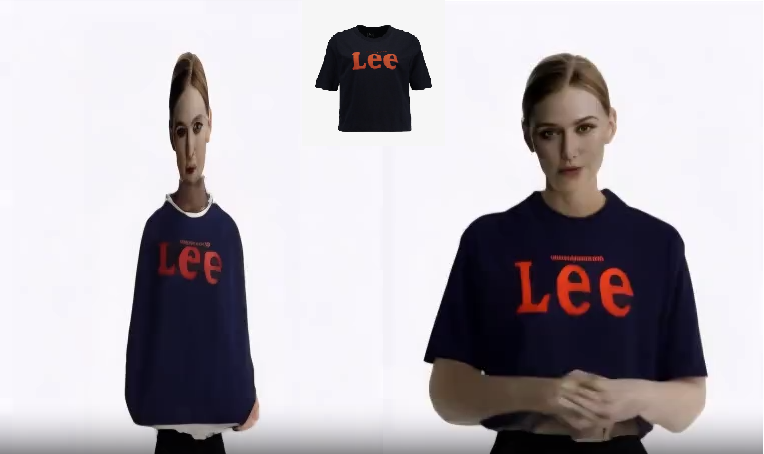. if the cloth and videos are not in the wdith/height ratio to 0.75, the generation quality will dropdown significantly. we use detection and padding/cropping to make sure our input images without any deformation
2. **Cloth image generation/retrieval**

    I use ViViD+HR-VTON dataset for our retrieval solution. applying CLIP-ViT-L14 model to generate and store embeddings. based on the given prompt it will provide the most matched cloth image for further video editing
    
    "Donald Duck T Shirt -- retrieved"
    
    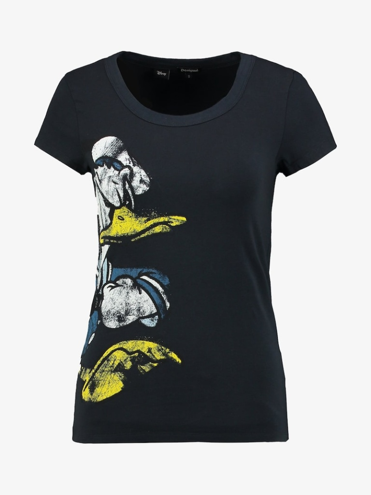
    
    For generation solution, I use openai Dalle-3 api to achieve the image acquisition. please input your open api key to `./OOTDiffusion/run/text2fashion.py` for generation function.

    ""Van Gogh starry sky T-shirt -- generated"
    
    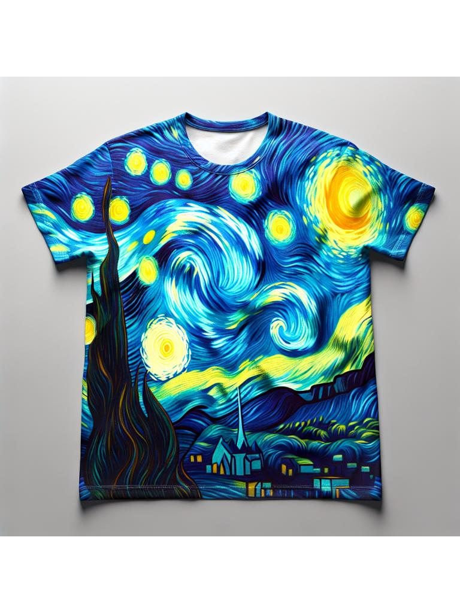

3. Auto Cloth mask creation

    Use YOLO-World+SAM to complete the task of Cloth Mask Creation and resizing.

    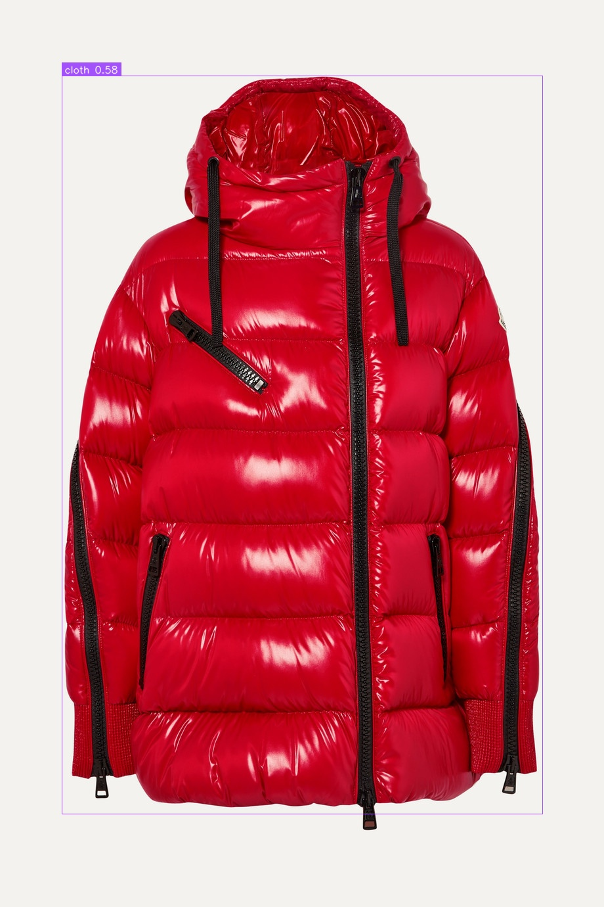
    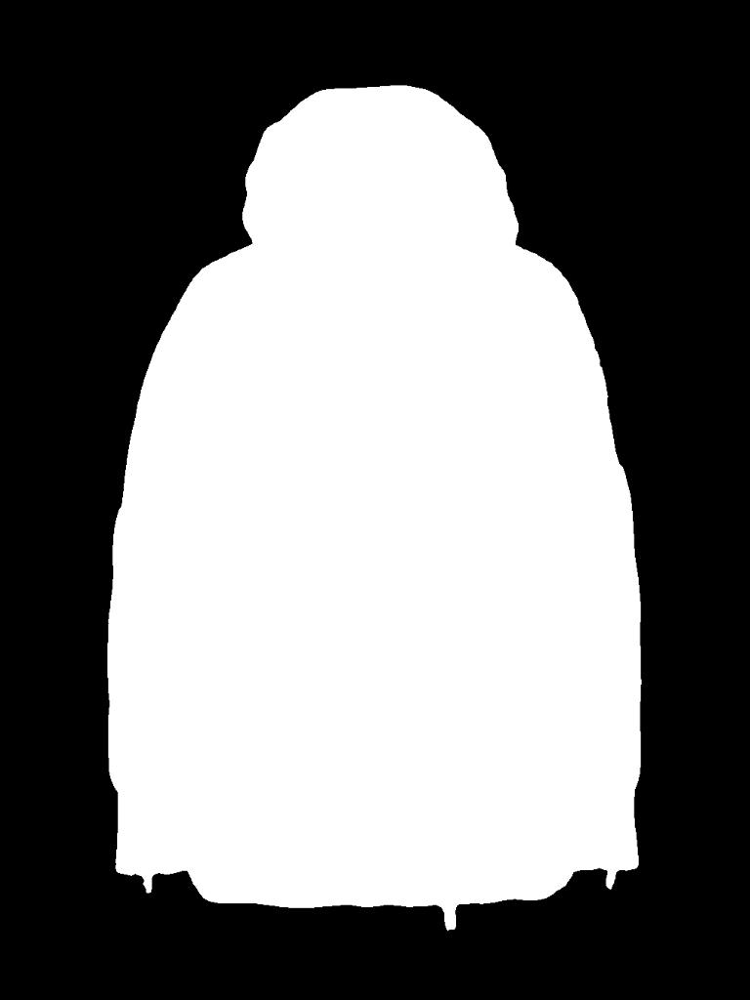

4. **Human Parse Mask Generation**.
    We follow [OOTDiffusion](https://github.com/levihsu/OOTDiffusion/tree/main?tab=readme-ov-file)'s pipeline for Human Parse Mask Generation. I observed the Human Parse Mask algorithm failed to recognize hands segmentation when hands area are within the cloth segmentation area. 

    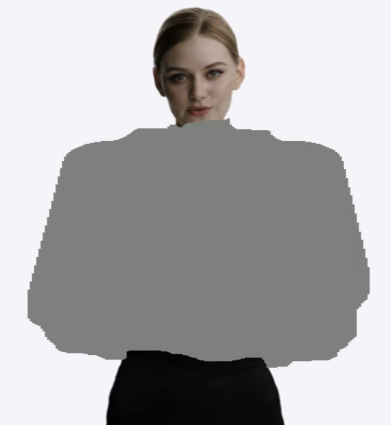

    even with temporal module, ViViD still suffering from consistent issue. please check `asset/vivid_original_results.mp4` for the entire clip results.

    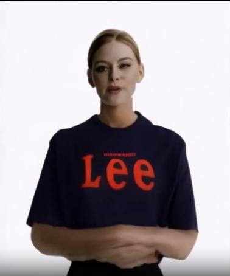
    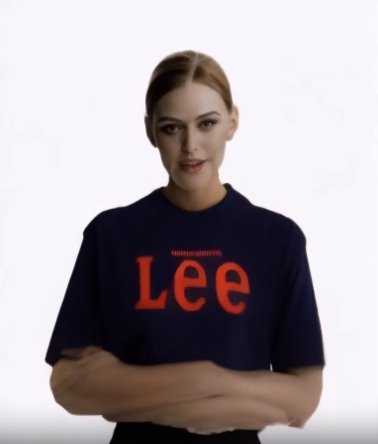
    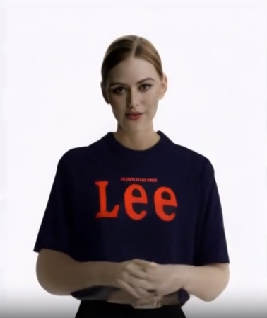

    in order to fix such problem I applied MP+SAM to modify the Human Parse Mask Result preseving hands. please check `asset/vivid_sam_hands.mp4` for the differences.

    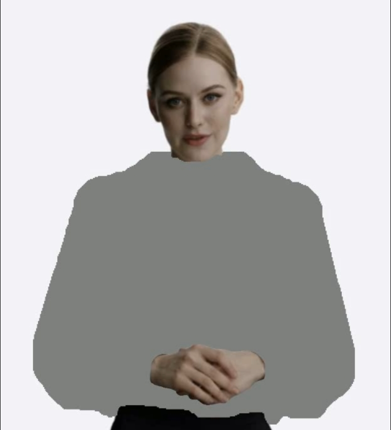
    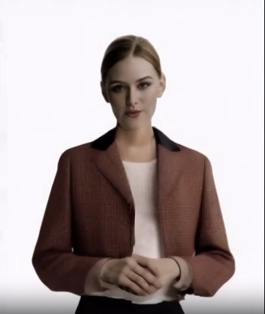
    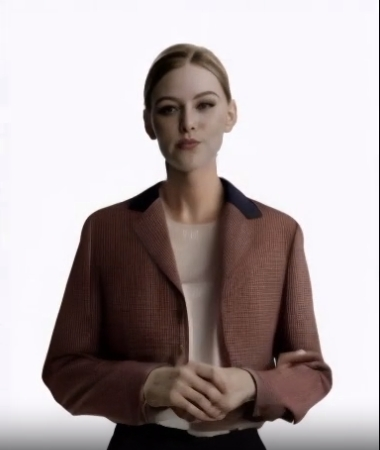
    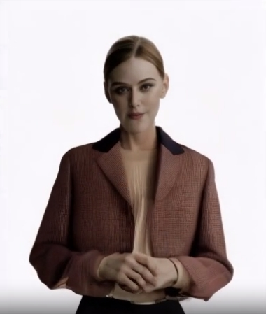

5. DensePose Video Generation.
    
    Same as ViViD --> [vid2densepose](https://github.com/Flode-Labs/vid2densepose/tree/main)

6. **Input Noise Modification**.

    as we can see in `asset/vivid_sam_hands.mp4` video, even though we fixed the hand inconsistency, the cloth's consistent issue still remain, in order to fix such problem, we applied Input Noise Modification. Instead of using random latent noise as the initial input. I first denoise the first frame's latent, and combine it with the original noise based on the noise steps we set. In here, the adding noise step is a tune-able hyper-parameter. Since ViViD is using DDIM so we apply adding noise after the denosing is completed to have more control on the noise level. I observe ~600 can produce significant improvements in general cases that I have tested on. please tune this number based on your own purpose of this application. please check `./src/pipelines/pipeline_pose2vid_long.py` for detail implementation. After all modification, our final results for text driven and image driven could be found in `asset/VI2Video-VTON_img_result.mp4` and `asset/VI2Video-VTON_text_result.mp4`
    

## Comparison Results ViViD-Vanilla Vs VI2Video-VTON
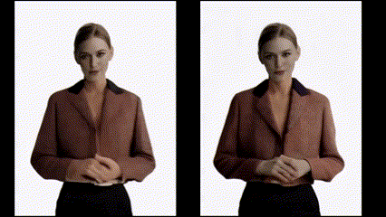

## More Examples
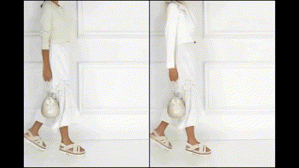
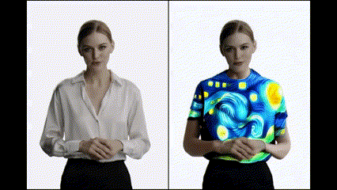
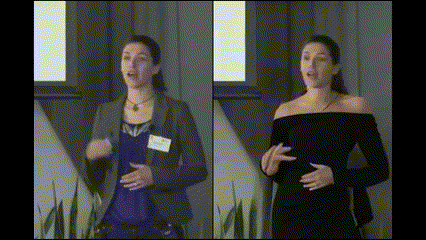
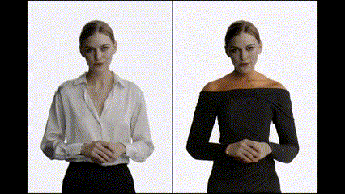


 

## Dataset
Datasets: [ViViD](https://huggingface.co/datasets/alibaba-yuanjing-aigclab/ViViD), [HR-VITON](https://github.com/sangyun884/HR-VITON)
create an new folder wherever you like, copy all cloth images from ViViD and HR-VTON to that folder and change `run_text.sh line 27` to your folder path

## Installation

```
git clone --recursive https://github.com/lizenan/TI2Video-VTON
cd TI2Video-VTON
```

### Environment
```
conda create -n ti2vton python=3.10
conda activate ti2vton
pip install torch==2.0.1 torchvision==0.15.2 torchaudio==2.0.2
pip install -r requirements.txt  
```
Warning: the requirements.txt hasn't been fully debugged. If you faced any problems on installing, feel free to contact me or checkout the README.MD files from the repos I have mentioned above for the full list of requirements. 

### Weights (Thanks for ViViD's and OOTD's detail instructions!)
You can place the weights anywhere you like, for example, ```./ckpts```. If you put them somewhere else, you just need to update the path for the following models.


#### Stable Diffusion Image Variations
```
cd ckpts

git lfs install
git clone https://huggingface.co/lambdalabs/sd-image-variations-diffusers
```
change `./configs/prompts/upper1.yaml` to your stored checkpoint location 
#### SD-VAE-ft-mse
```
git lfs install
git clone https://huggingface.co/stabilityai/sd-vae-ft-mse
```
change `./configs/prompts/upper1.yaml` to your stored checkpoint location 
#### Motion Module
Download [mm_sd_v15_v2](https://huggingface.co/guoyww/animatediff/blob/main/mm_sd_v15_v2.ckpt)

#### ViViD
```
git lfs install
git clone https://huggingface.co/alibaba-yuanjing-aigclab/ViViD
```
change `./configs/prompts/upper1.yaml` to your stored checkpoint location 

#### OOTDiffusion
```
git lfs install
https://huggingface.co/levihsu/OOTDiffusion
```
change `./OOTDiffusion/ootd/inference_ootd_hd.py Line 27-30` and `./OOTDiffusion/preprocess/humanparsing/run_parsing.py Line 20&22` and `./OOTDiffusion/preprocess/openpose/annotator/util.py Line 10` to your stored checkpoint location 

Please also download [clip-vit-large-patch14](https://huggingface.co/openai/clip-vit-large-patch14) into checkpoints folder

#### YOLO-WORLD

[google drive](https://drive.google.com/file/d/1xmrAOK9JKZm6bmLzGjx4EkcnoxeXhxAo/view?usp=sharing) 

change `run_img.sh line 36&38` and `run_text.sh line 48&50` to your stored checkpoint location

#### SAM

download [SAM](https://dl.fbaipublicfiles.com/segment_anything/sam_vit_h_4b8939.pth)

change `./OOTDiffusion/run/run_ootd_agnostic.py Line 63` to your stored checkpoint location

## Inference
inherit from OOTDiffusion and ViViD, we support upper mode or full(dress) mode editing, please run `run_img.sh` for image driven video editing and `run_text.sh` for text driven video editing.
```
bash run_img.sh <path/to/video> <path/to/cloth_img> upper/full

bash run_text.sh <path/to/video> "text prompt" upper/full
```

## TO-DO
1. this application is built in two days, the strcture and checkpoint calling config is messy, I will refactor them in one config file manner.
2. there are some workflow optimization tasks could do to reduce the process time. 
3. Inspired by Animate Anyone's spatial attention module, for improving the video consistency, I'm planning to reconstruct the ViViD inference code to concatenate with previous generated frames' intermediate values with the following frames for the following frames generation. see if it helps with the generation quality. 


## Thanks to
ViViD, OOTDiffusion, SAM, Mediapipe, YOLO-WORLD, HR-VTON, CLIP, Stable Diffusion, Huggingface, Densepose, and everyone who keeping the open source community thrived.

## Contact Us
**Zenan Li**: [zenanlicareer@gmail.com](mailto:zenanlicareer@gmail.com)  

